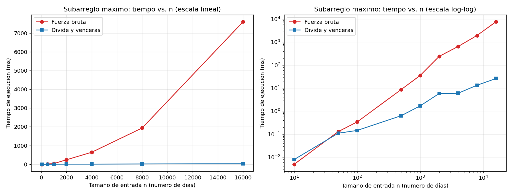

# Laboratorio evaluativo 02 - Dividir y vencer

**Autora:** Sara López Cardona

## Cómo reproducir

Desde la raíz del repositorio (PowerShell):

```powershell
venv\Scripts\Activate.ps1
cd laboratorios\lab2-divide-y-vencer
python pruebas.py     # pruebas con assert
python medicion.py    # mediciones y graficas/tiempo_vs_n.png
```

## Parte 1 - Implementar y verificar

Código: [subarreglo.py](subarreglo.py) y [pruebas.py](pruebas.py).

`pruebas.py` usa `assert` y cubre la serie de ocho días (suma 17, tramo días 2 a 7), un solo elemento, todos negativos (gana el menos negativo), todos positivos (gana toda la serie), un caso donde el mejor tramo cruza el punto medio (`[-10,-10,6,7,8,9,-10,-10]`, suma 30), comprobación de que la lista no se modifica y 50 listas aleatorias (semilla fija) donde ambas funciones dan la misma suma, comparando sumas y no índices. Además verifica que la suma del tramo devuelto coincide con la suma reportada.

## Parte 2 - Medir y graficar

Código: [medicion.py](medicion.py).



Medición: datos enteros en [-100, 100] con semilla fija (2026), la misma lista para ambos algoritmos en cada tamaño. Solo se cronometra la llamada con `time.perf_counter()`. Cada medición se repitió 3 veces y se grafica la **mediana**. En cada tamaño se verifica que ambas sumas coincidemn. La figura muestra escala lineal (izquierda) y log-log (derecha).

| n | Fuerza bruta (ms) | Divide y vencerás (ms) |
|---:|---:|---:|
| 10 | 0,00489 | 0,00789 |
| 50 | 0,128 | 0,109 |
| 100 | 0,338 | 0,144 |
| 500 | 0,659 | 0,629 |
| 1000 | 35,340 | 1,682 |
| 2000 | 237,89 | 5,784 |
| 4000 | 639,181 | 5,919 |
| 8000 | 1934,41 | 13,280 |
| 16000 | 7605,286 | 25,934 |
